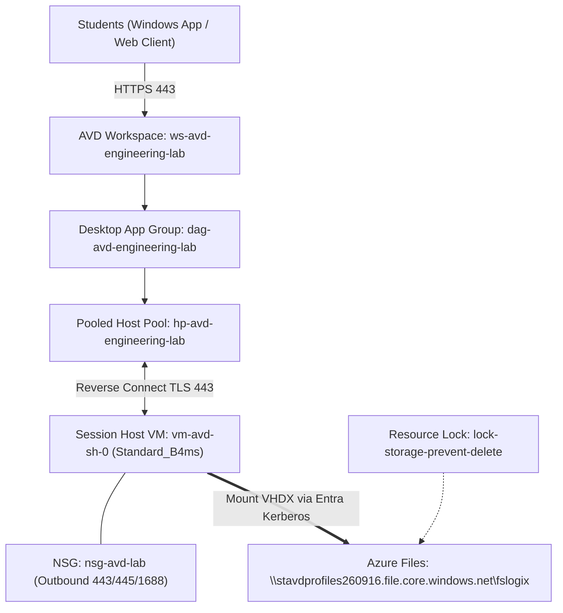

# 2400031215-Azure: Azure Virtual Desktop Pooled Host Pool for an Engineering Lab

[](https://azure.microsoft.com/services/virtual-desktop/)
[](https://learn.microsoft.com/azure/azure-resource-manager/bicep/)
[](https://www.microsoft.com/security/business/identity-access/microsoft-entra-id)
[](https://learn.microsoft.com/fslogix/)

---

## * Project Overview
* **Project Name**: Azure Virtual Desktop Pooled Host Pool for an Engineering Lab
* **Repository ID**: `2400031215-Azure`
* **Student Name**: Bhimavarapu Hema Varshith Reddy (ID: `2400031215`)
* **Institution**: K L University
* **Target Cohort**: ~50 Engineering Students accessing computational and CAD software
* **Azure Subscription**: Azure for Students (Region: `indiasouthcentral`, Metadata Region: `centralindia`)

This repository documents the end-to-end design, implementation, and empirical testing of an enterprise-grade pooled Azure Virtual Desktop environment with decoupled user profiles utilizing FSLogix profile containers on Azure Files.

---

## * Repository Deliverables

```text
├── Azure_Virtual_Desktop_abstract.pdf                # Project abstract & problem statement
├── azure project requirements.pdf                    # Faculty practical tasks 1-5 requirements
├── Azure_Virtual_Desktop_Architecture.pdf            # Multi-tier cloud architecture blueprint
├── Azure_Virtual_Desktop_Pooled_Host_Pool_Lab ppt.pdf# Project presentation slide deck
├── azure project Azure Virtual Desktop.pdf           # Comprehensive final project report
├── README.md                                         # Main repository guide
├── bicep/                                            # Modular Infrastructure-as-Code
│   ├── main.bicep                                    # Orchestrator Bicep template
│   ├── main.bicepparam                               # Deployment parameters
│   └── modules/
│       ├── avd-control-plane.bicep                   # Host Pool, App Group, Workspace
│       ├── network.bicep                             # Network Security Group
│       └── session-host.bicep                        # Session Host VM with Entra Join
├── docs/                                             # Technical source documentation
│   ├── 01_PROJECT_ABSTRACT.md
│   ├── 02_PROJECT_REQUIREMENTS.md
│   ├── 03_SYSTEM_ARCHITECTURE.md
│   ├── 04_AVD_ACCESS_AND_APPLICATION_DELIVERY.md
│   └── 05_LIVE_DEPLOYMENT_STATUS.md
└── scripts/
    └── fslogix-config.ps1                            # FSLogix profile container configuration
```

---

## * System Architecture



---

## * Faculty Practical Tasks Coverage

* **Task 1: Resource Group & Managed Disks** → Implemented in `rg-avd-engineering-lab` with 128 GB Standard SSD managed OS disk.
* **Task 2: Microsoft Entra Users & Groups** → Created security group `AVD-Engineering-Lab-Students` and assigned `Desktop Virtualization User` role.
* **Task 3: Resource Management & Resource Locks** → Applied `CanNotDelete` lock on storage account `stavdprofiles260916`.
* **Task 4: Networking & Subnet Security** → Configured `vnet-avd-lab` and `snet-avd` protected by `nsg-avd-lab`.
* **Task 5: Compute & Storage Authentication** → Deployed `stavdprofiles260916` provisioned SMB share with Microsoft Entra Kerberos (`AADKERB`).

---

## * Security & Cost Governance
* **Reverse Connect Architecture**: Zero inbound ports exposed from the internet to the session host.
* **Auto-Shutdown Schedule**: DevTestLabs automated daily shutdown enforced at 18:00 UTC (23:30 IST) to preserve student credits.
* **Single Host Staging**: Only one initial VM (`Standard_B4ms` / `Standard_D4s_v4`) used for empirical testing before scale-out calculations.
