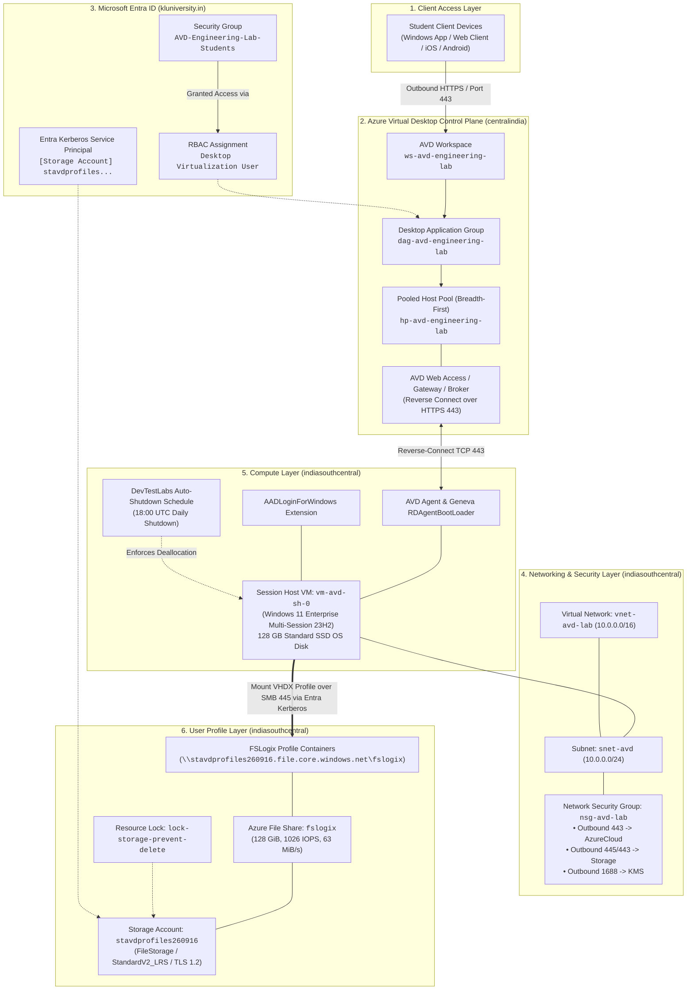

# System Architecture: Azure Virtual Desktop Engineering Lab

**Project:** Azure Virtual Desktop Pooled Host Pool for an Engineering Lab  
**Student ID:** 2400031215  

---

## 1. High-Level Architectural Diagram

---

## 2. Component Architecture Breakdown

### 2.1 Reverse Connect Gateway Architecture
Unlike traditional remote desktop infrastructures that expose TCP port 3389 inbound to the public internet, Azure Virtual Desktop utilizes **Reverse Connect**:
* The session host agent initiates an outbound connection over **HTTPS (TCP 443)** to the nearest Azure Virtual Desktop gateway service.
* Incoming client traffic terminates at the Azure PaaS gateway.
* No public IP addresses, inbound NAT rules, or perimeter firewalls are required on individual session host virtual machines.

### 2.2 Geographically Distributed Metadata Plane
* **Control Plane Metadata**: Anchored in `centralindia` (the official Azure Virtual Desktop metadata region for the India geography).
* **Workload & Data Plane**: Session host virtual machines, virtual networks, and storage accounts remain co-located in `indiasouthcentral` to ensure ultra-low latency (<5ms) between session hosts and profile storage.

### 2.3 FSLogix Profile Decoupling
* FSLogix attaches the user profile container as an active virtual hard disk (`VHDX`) at logon.
* Applications perceive the profile as a standard local folder (`C:\Users\<username>`), ensuring native app compatibility without profile corruption across pooled sessions.
