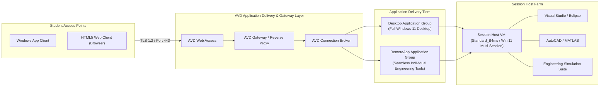

# Application Delivery, Gateway Architecture & Comparison with Application Gateway

**Project:** Azure Virtual Desktop Pooled Host Pool for an Engineering Lab  
**Student ID:** 2400031215  

---

## 1. Context: Application Delivery Models in Azure

In enterprise cloud architecture, the method of publishing and securing applications depends directly on the application architecture:

| Architectural Dimension | Traditional Web Workloads (e.g. Project P10) | Engineering Desktop & Virtualized Workloads (This Project) |
| :--- | :--- | :--- |
| **Workload Type** | Web applications, APIs, microservices (HTTP/HTTPS) | Heavy desktop applications (CAD, IDEs, 3D modeling, simulations) |
| **Delivery Mechanism** | **Azure Application Gateway (with WAF)** | **Azure Virtual Desktop (AVD) Gateway & Application Groups** |
| **OS Requirement** | Linux/Windows Web Servers or Container Apps | Windows 11 Enterprise Multi-Session |
| **Traffic Flow** | Inbound reverse proxy on Ports 80 / 443 | Outbound Reverse Connect over TLS (TCP 443) |
| **Client Interface** | Web Browser | Windows App, Web Client, Remote Desktop Client |
| **Security Perimeter** | Web Application Firewall (OWASP CRS Rules) | Microsoft Entra ID Pre-Authentication, MFA, Conditional Access, NSGs |

---

## 2. AVD Application Delivery Architecture

Instead of routing traffic through an Application Gateway that inspects HTTP headers, Azure Virtual Desktop provides a dedicated **PaaS Application Delivery Fabric**:

---

## 3. How Applications are Published in AVD

### 3.1 Full Desktop Delivery (Desktop Application Group)
* Delivers an entire managed Windows 11 multi-session desktop environment.
* Configured in this project via `dag-avd-engineering-lab`.
* Best suited for engineering students who require multi-window workflows, local file interaction, and multiple development toolchains simultaneously.

### 3.2 Individual RemoteApp Delivery (RemoteApp Application Group)
* Publishes specific engineering executables directly to the student's local desktop without launching a full desktop session.
* Applications appear seamlessly in the student's local start menu or taskbar.
* Conserves session host memory by only launching the specific executable processes requested by the user.

---

## 4. Architectural Comparison: AVD Gateway vs. Azure Application Gateway

### Why AVD Does Not Use Application Gateway Directly
1. **Protocol Mismatch**: Azure Application Gateway operates at Layer 7 specifically for HTTP, HTTPS, and WebSocket protocols. AVD sessions utilize Microsoft RDP (Remote Desktop Protocol) encapsulated inside dynamic TLS/UDP channels.
2. **Reverse Connect Advantage**: AVD session hosts do not listen for incoming connections. Instead, they dial *outbound* to the AVD Gateway on port 443. Consequently, there are no inbound ports to load balance or expose via an Application Gateway.
3. **Built-in Global Anycast Routing**: AVD Gateway leverages Microsoft's global WAN edge (Front Door infrastructure), automatically connecting students to the lowest-latency gateway entry point worldwide without deploying dedicated regional gateway VMs.

### Optional Hybrid Integration (Where Application Gateway Fits)
If an engineering department deploys an on-premises or internal **Web Licensing Server** (e.g., FlexLM license manager portal for engineering software) within the same VNet, an **Azure Application Gateway with WAF** can be deployed in front of the licensing portal to provide OWASP Layer 7 threat inspection for internal web portals.
